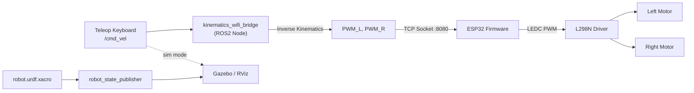

<div align="center">

# 🤖 ROS2 Modular DiffBot

### Sim-to-Real Differential Drive Robot — ROS2 Humble + Gazebo + ESP32

*A modular, open-loop differential-drive mobile robot built from scratch: simulated in Gazebo, deployed on real low-cost hardware over WiFi.*

[](https://docs.ros.org/en/humble/)
[](https://classic.gazebosim.org/)
[](https://www.espressif.com/en/products/socs/esp32)
[](https://www.python.org/)
[](LICENSE)
[](#)


</div>

---

## 📖 Overview

**ROS2 Modular DiffBot** is a complete, portfolio-grade differential-drive mobile robot pipeline — from URDF kinematic modeling to Gazebo physics simulation to real-world deployment on a $15 hardware stack (ESP32 + L298N + plain BO motors, no encoders).

The project deliberately avoids Nav2/SLAM complexity to focus on **doing the fundamentals correctly**: accurate URDF/Xacro modeling, differential-drive inverse kinematics, a clean ROS2↔microcontroller communication bridge, and a reproducible sim-to-real workflow — the same foundation every higher-level robotics stack (navigation, SLAM, RL) is built on.

> **Why this project exists:** Most beginner ROS2 robots either stay purely in simulation or skip the kinematics layer entirely by using pre-built libraries. This project implements the differential-drive inverse kinematics **from first principles**, bridges it to real open-loop hardware over TCP/WiFi, and validates behavior in both Gazebo and the physical world — a genuine sim-to-real loop.

---


## 🎥 Demo

| Images | Simulation & Real Hardware |
|:---:|:---:|
| <br><br> | <video src="https://github.com/user-attachments/assets/5dacb795-1607-4ec2-95c9-e01f3a8a5c59" autoplay loop muted playsinline width="100%"></video> |

<br>

<a href="https://drive.google.com/file/d/1XATqPz2DIHgkIiWCGD5nkkuKgArQS4mZ/view?usp=drive_link" target="_blank">click here for the full demo video</a>


---

## ✨ Key Features

| Category | Details |
|---|---|
| 🔧 **Modular URDF/Xacro** | Fully parameterized robot description split into `robot_core.xacro` (links/joints/inertials) and `robot_gazebo.xacro` (simulation plugins) |
| 🌐 **Gazebo Simulation** | Physics-accurate differential drive simulation using `libgazebo_ros_diff_drive`, custom world file, RViz visualization config |
| 📡 **Custom WiFi Bridge Node** | A ROS2 node (`kinematics_wifi_bridge`) that subscribes to `/cmd_vel`, computes per-wheel PWM via inverse kinematics, and streams commands to the ESP32 over a persistent TCP socket — with auto-reconnect logic |
| ⚙️ **Open-Loop Kinematics** | Differential-drive inverse kinematics implemented from scratch (no encoders) — converts `Twist` → wheel angular velocity → calibrated PWM |
| 🔌 **ESP32 Firmware** | Custom Arduino firmware: static IP, TCP server, dual-channel LEDC PWM motor control via L298N |
| 🧪 **CI-Ready Test Suite** | `ament_copyright`, `ament_flake8`, `ament_pep257` — standard ROS2 package quality gates |
| 🚀 **One-Command Launch** | Separate `launch_sim.launch.py` (Gazebo) and `launch_real.launch.py` (hardware) entry points |

---

## 🏗️ System Architecture



**Two parallel pipelines, one command interface:**
- **Simulation path:** `/cmd_vel` → Gazebo's `libgazebo_ros_diff_drive` plugin → simulated physics
- **Real path:** `/cmd_vel` → `kinematics_wifi_bridge` → inverse kinematics → TCP → ESP32 → L298N → real motors

---

## 🔩 Hardware Stack

| Component | Spec |
|---|---|
| Microcontroller | ESP32 DevKit (WiFi) |
| Motor Driver | L298N Dual H-Bridge |
| Motors | Plain BO motors (no encoders — open-loop control) |
| Chassis | Acrylic 2WD + caster wheel kit |
| Power | 3x 18650 Battery Pack with 5V Buck Converter |
| Comms | WiFi (static IP) — TCP socket, port 8080 |

---

## 🔌 Wiring & Pinout

**1. Power & Switch Distribution**
* **Battery (3x 18650) Red (+)** ➔ Switch (Input)
* **Battery (3x 18650) Black (-)** ➔ L298N (GND) **AND** Buck Converter (IN-)
* **Switch (Output)** ➔ L298N (12V) **AND** Buck Converter (IN+)

**2. Step-down Power (Buck Converter ➔ ESP32)**
* **Buck Converter OUT+** ➔ ESP32 VIN / 5V
* **Buck Converter OUT-** ➔ ESP32 GND

**3. Logic & Control (ESP32 ➔ L298N)**
* **ESP32 GPIO 25** ➔ L298N ENA (Left Motor PWM)
* **ESP32 GPIO 26** ➔ L298N IN1
* **ESP32 GPIO 27** ➔ L298N IN2
* **ESP32 GPIO 32** ➔ L298N IN3
* **ESP32 GPIO 14** ➔ L298N IN4
* **ESP32 GPIO 33** ➔ L298N ENB (Right Motor PWM)

**4. Power Output (L298N ➔ Motors)**
* **L298N OUT1 & OUT2** ➔ Left Motor
* **L298N OUT3 & OUT4** ➔ Right Motor

> **⚠️ Critical Hardware Notes:**
> * Keep the L298N 5V jumper cap **ON** (intact).
> * Remove ENA/ENB jumper caps for ESP32 PWM speed control (otherwise motors will run at constant full speed).
> * **Common Ground:** Ensure all Grounds (Battery, L298N, Buck Converter, ESP32) are explicitly connected together.
> * Motor wires connect *only* to the L298N OUT pins, never directly to the ESP32.

---

## 📁 Repository Structure

```
ros2_modular_diffbot/
├── config/
│   └── view_bot.rviz              # RViz display configuration
├── esp32_firmware/
│   └── esp32_diffbot_firmware.ino # ESP32 TCP server + motor control
├── launch/
│   ├── launch_sim.launch.py       # Gazebo simulation launch
│   ├── launch_real.launch.py      # Real hardware launch
│   └── rsp.launch.py              # robot_state_publisher launch
├── ros2_modular_diffbot/
│   └── kinematics_wifi_bridge.py  # cmd_vel -> PWM -> TCP bridge node
├── urdf/
│   ├── robot.urdf.xacro           # Top-level robot description
│   ├── robot_core.xacro           # Links, joints, inertials
│   └── robot_gazebo.xacro         # Gazebo diff-drive plugin config
├── worlds/
│   └── basic_world.world          # Gazebo test world
├── test/                          # ament_copyright / flake8 / pep257
└── docs/                          # Diagrams, media, technical notes
```

---

## ⚡ Quick Start

### Prerequisites
```bash
# ROS2 Humble + Gazebo Classic installed
sudo apt install ros-humble-gazebo-ros-pkgs ros-humble-xacro ros-humble-teleop-twist-keyboard
```

### Build
```bash
cd ~/ros2_ws/src
git clone https://github.com/<your-username>/ros2_modular_diffbot.git
cd ~/ros2_ws
colcon build --packages-select ros2_modular_diffbot
source install/setup.bash
```

### 1️⃣ Run in Simulation (Gazebo)
```bash
ros2 launch ros2_modular_diffbot launch_sim.launch.py
ros2 run teleop_twist_keyboard teleop_twist_keyboard
```

### 2️⃣ Run on Real Hardware
```bash
# Flash esp32_firmware/esp32_diffbot_firmware.ino to your ESP32 first
ros2 launch ros2_modular_diffbot launch_real.launch.py
ros2 run teleop_twist_keyboard teleop_twist_keyboard --ros-args -p speed:=0.30 -p turn:=3.45
```

---

## 🧠 Kinematics — Implementation Notes

The `kinematics_wifi_bridge` node converts a `geometry_msgs/Twist` command into individual wheel PWM values using standard differential-drive inverse kinematics:

```
v_r = v + (ω · L) / 2        v_l = v − (ω · L) / 2
ω_r = v_r / R                ω_l = v_l / R
PWM = clamp(ω_wheel × scale_factor, −max_pwm, max_pwm)
```

Where `L` = wheel base, `R` = wheel radius. Since the motors are **open-loop (no encoders)**, `speed_to_pwm_scale` is an empirically calibrated constant rather than a closed-loop gain — a deliberate, documented trade-off for this hardware tier (see [`docs/calibration.md`](docs/calibration.md)).

---

## 🧪 Testing

```bash
colcon test --packages-select ros2_modular_diffbot
colcon test-result --verbose
```

Covers copyright headers, PEP8 (`flake8`), and docstring conventions (`pep257`) — standard ROS2 package hygiene checks.

---

## 🗺️ Roadmap

- [ ] Add wheel encoders → closed-loop velocity control
- [ ] IMU integration for odometry fusion
- [ ] Nav2 stack integration
- [ ] Migrate WiFi bridge to `micro-ROS` (native ROS2 on ESP32, no custom TCP protocol)
- [ ] Upgrade to Autonomous Mini Cleaning Robot via Reinforcement Learning in Nvidia Isaac Sim

---

## 👤 Author

**Sikder Moynul Hasan (Moynul Rifat)** — Robotics & AI Researcher | BSc ICT, MBSTU <br>
🔗 [Portfolio](https://e-moynul.github.io) <br>
🔗 [LinkedIn](https://linkedin.com/in/sikder-moynul-hasan-2a8a70345) <br>
🔗 📄 **Publication:** [Performance Analysis of Modern Filesystems (IEEE)](https://ieeexplore.ieee.org/document/11546556)

## 📄 License

This project is licensed under the MIT License — see [LICENSE](LICENSE) for details.
